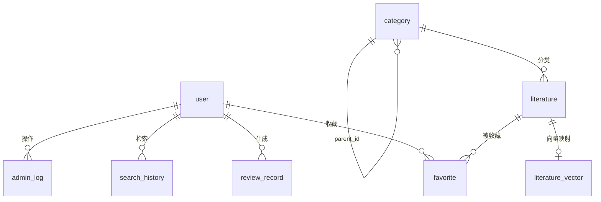

# 数据库设计文档

## 1 数据库概述

系统使用 MySQL 存储结构化业务数据，使用 backend-ai 的本地文件存储 FAISS 向量索引。二者分工如下：

- MySQL：用户、文献、分类、收藏、检索历史、综述记录、管理员日志、LLM API 配置等。
- backend-ai 文件：`backend-ai/data/faiss.index` 和 `backend-ai/data/id_map.json`。

文献数据来自课程项目模拟数据脚本，不是真实论文库。

## 2 SQL 文件说明

| 文件 | 作用 |
|---|---|
| `database/init.sql` | 创建数据库、基础表、管理员占位账号、两级分类和少量示例文献 |
| `database/update_categories.sql` | 重建两级分类体系，包含 6 个一级分类和 37 个二级分类 |
| `database/literature_seed_100.sql` | 追加 100 条模拟文献数据 |
| `database/literature_seed_500_high_quality.sql` | 追加 500 条课程项目模拟文献，使用二级分类 ID 7 到 43 |
| `database/update_llm_config.sql` | 创建 `llm_config` 表，并为 `review_record` 增加 `generation_mode` |

注意：实际初始化时应先执行基础建表，再执行分类和数据脚本。导入或修改文献后，需要管理员重建智能检索索引。

## 3 数据表关系

SQL 脚本中主要通过字段进行逻辑关联，未显式声明外键约束。主要关系如下：

- `user` 与 `favorite`：一名用户可收藏多篇文献。
- `literature` 与 `favorite`：一篇文献可被多个用户收藏。
- `category` 与 `literature`：文献通过 `category_id` 关联分类。
- `category` 通过 `parent_id` 自关联形成两级分类。
- `user` 与 `review_record`：一名用户可生成多条综述记录。
- `user` 与 `search_history`：一名用户可有多条检索历史。
- `llm_config`：管理员维护的在线 LLM API 配置，在线综述生成读取 active 配置。

## 4 表结构

### 4.1 user

用户与管理员账号表。

| 字段 | 类型 | 说明 |
|---|---|---|
| id | BIGINT PK AUTO_INCREMENT | 用户 ID |
| username | VARCHAR(50) UNIQUE NOT NULL | 用户名 |
| password_hash | VARCHAR(255) NOT NULL | 密码哈希，后端使用 BCrypt |
| real_name | VARCHAR(50) | 真实姓名 |
| email | VARCHAR(100) | 邮箱 |
| role | VARCHAR(20) NOT NULL DEFAULT 'USER' | `USER` 或 `ADMIN` |
| status | TINYINT NOT NULL DEFAULT 1 | 1 正常，0 禁用 |
| create_time | DATETIME | 创建时间 |
| update_time | DATETIME | 更新时间 |

说明：`init.sql` 中管理员密码是初始化占位值，后端启动时 `DataInitializer` 会将非 BCrypt 格式密码转换为 BCrypt 哈希。

### 4.2 category

文献分类表，支持两级分类。

| 字段 | 类型 | 说明 |
|---|---|---|
| id | BIGINT PK AUTO_INCREMENT | 分类 ID |
| name | VARCHAR(100) NOT NULL | 分类名称 |
| parent_id | BIGINT DEFAULT 0 | 父分类 ID，0 表示一级分类 |
| sort_order | INT DEFAULT 0 | 排序 |
| create_time | DATETIME | 创建时间 |

说明：

- 一级分类：`parent_id = 0`。
- 二级分类：`parent_id != 0`。
- `update_categories.sql` 定义 6 个一级分类和 37 个二级分类。
- `literature_seed_500_high_quality.sql` 的文献分类使用二级分类 ID 7 到 43。

### 4.3 literature

文献元数据表。

| 字段 | 类型 | 说明 |
|---|---|---|
| id | BIGINT PK AUTO_INCREMENT | 文献 ID |
| title | VARCHAR(255) NOT NULL | 标题 |
| authors | VARCHAR(255) | 作者 |
| abstract_text | TEXT | 摘要 |
| keywords | VARCHAR(255) | 关键词 |
| journal | VARCHAR(255) | 期刊或会议名称 |
| publish_year | INT | 发表年份 |
| doi | VARCHAR(100) | DOI |
| category_id | BIGINT | 分类 ID |
| citation_count | INT DEFAULT 0 | 引用次数 |
| file_url | VARCHAR(500) | 文献文件地址，可选字段 |
| source | VARCHAR(255) | 数据来源 |
| document_type | VARCHAR(50) | 期刊论文、会议论文、学位论文、研究报告 |
| source_url | VARCHAR(255) | 来源链接 |
| content | TEXT | 正文节选或内容说明 |
| create_time | DATETIME | 创建时间 |
| update_time | DATETIME | 更新时间 |

说明：

- 普通检索匹配 `title`、`abstract_text`、`keywords`、`content`。
- 智能检索向量化使用标题、分类、文献类型、关键词、摘要、正文节选。
- 综述生成使用标题、作者、年份、期刊、关键词、摘要和正文节选。

### 4.4 favorite

收藏关系表。

| 字段 | 类型 | 说明 |
|---|---|---|
| id | BIGINT PK AUTO_INCREMENT | 收藏 ID |
| user_id | BIGINT NOT NULL | 用户 ID |
| literature_id | BIGINT NOT NULL | 文献 ID |
| create_time | DATETIME | 收藏时间 |

约束：

- `UNIQUE KEY uk_user_literature (user_id, literature_id)`，防止重复收藏。

### 4.5 search_history

检索历史表，当前实际存在。

| 字段 | 类型 | 说明 |
|---|---|---|
| id | BIGINT PK AUTO_INCREMENT | 历史 ID |
| user_id | BIGINT NOT NULL | 用户 ID |
| keyword | VARCHAR(255) NOT NULL | 检索关键词 |
| search_type | VARCHAR(30) DEFAULT 'NORMAL' | 检索类型 |
| result_count | INT DEFAULT 0 | 结果数量 |
| create_time | DATETIME | 检索时间 |

说明：

- `init.sql` 创建该表。
- Java 代码在普通文献检索时保存 `NORMAL` 历史。
- 当前智能语义检索接口未写入 `SEMANTIC` 历史，可作为后续优化点。

### 4.6 review_record

综述记录表。

| 字段 | 类型 | 说明 |
|---|---|---|
| id | BIGINT PK AUTO_INCREMENT | 综述记录 ID |
| user_id | BIGINT NOT NULL | 用户 ID |
| topic | VARCHAR(255) NOT NULL | 综述主题 |
| literature_ids | TEXT | 使用的文献 ID，如 `1,2,3` |
| content | LONGTEXT | 综述正文 |
| reference_text | TEXT | 参考来源说明 |
| generation_mode | VARCHAR(30) DEFAULT 'rule' | 生成模式 |
| create_time | DATETIME | 生成时间 |
| update_time | DATETIME | 更新时间 |

`generation_mode` 取值：

- `rule`：离线综述生成
- `llm`：在线 LLM 增强综述生成
- `llm_fallback_rule`：在线 LLM 不可用或输出校验失败，降级为离线生成

说明：`generation_mode` 由 `update_llm_config.sql` 添加。若只执行 `init.sql`，需要补执行该更新脚本。

### 4.7 llm_config

LLM API 配置表。

| 字段 | 类型 | 说明 |
|---|---|---|
| id | BIGINT PK AUTO_INCREMENT | 配置 ID |
| name | VARCHAR(100) NOT NULL | 配置名称 |
| provider | VARCHAR(50) NOT NULL | `openai-compatible`、`openai`、`deepseek`、`qwen`、`custom` |
| base_url | VARCHAR(255) NOT NULL | API Base URL |
| model | VARCHAR(100) NOT NULL | 模型名称 |
| api_key | TEXT | API Key |
| enabled | TINYINT DEFAULT 1 | 是否启用 |
| active | TINYINT DEFAULT 0 | 是否当前使用 |
| timeout_seconds | INT DEFAULT 30 | 超时时间 |
| remark | VARCHAR(255) | 备注 |
| create_time | DATETIME | 创建时间 |
| update_time | DATETIME | 更新时间 |

安全说明：

- 前端不接收 `api_key` 明文，只接收 `apiKeyMasked`。
- `apiKeyMasked` 由后端根据 Key 前 4 位和后 4 位生成，中间以 `****` 替代。
- 课程演示环境可以保存配置；生产环境应使用加密存储、环境变量、密钥轮换和访问审计。
- 不要在 SQL、文档或 Git 中写真实 API Key。

### 4.8 admin_log

管理员操作日志表。

| 字段 | 类型 | 说明 |
|---|---|---|
| id | BIGINT PK AUTO_INCREMENT | 日志 ID |
| admin_id | BIGINT NOT NULL | 管理员 ID |
| operation | VARCHAR(100) NOT NULL | 操作类型 |
| target_type | VARCHAR(50) | 操作对象类型 |
| target_id | BIGINT | 操作对象 ID |
| detail | TEXT | 操作详情 |
| create_time | DATETIME | 操作时间 |

当前代码在修改用户状态时写入管理员日志。

### 4.9 literature_vector

文献向量映射辅助表。

| 字段 | 类型 | 说明 |
|---|---|---|
| id | BIGINT PK AUTO_INCREMENT | 记录 ID |
| literature_id | BIGINT UNIQUE NOT NULL | 文献 ID |
| vector_index_id | BIGINT | FAISS 中的向量位置 |
| embedding_model | VARCHAR(100) | 向量模型 |
| update_time | DATETIME | 更新时间 |

说明：该表为可选辅助表。当前 backend-ai 的实际 FAISS 索引文件保存在 `backend-ai/data`，不依赖 MySQL 存储向量本体。

## 5 索引设计

SQL 中明确创建的索引包括：

| 表 | 索引 | 说明 |
|---|---|---|
| `user` | `username` 唯一约束 | 用户名唯一 |
| `literature` | `idx_title(title)` | 标题检索 |
| `literature` | `idx_year(publish_year)` | 年份筛选 |
| `literature` | `idx_category(category_id)` | 分类筛选 |
| `literature` | `idx_document_type(document_type)` | 文献类型筛选 |
| `favorite` | `uk_user_literature(user_id, literature_id)` | 防止重复收藏 |
| `review_record` | `idx_user_time(user_id, create_time)` | 个人综述记录查询 |
| `search_history` | `idx_user_time(user_id, create_time)` | 个人检索历史查询 |

`abstract_text` 和 `content` 当前未建立全文索引。智能检索主要依赖 backend-ai 的 FAISS 索引，MySQL 补充召回使用 `LIKE` 匹配扩展词。

## 6 与智能检索的关系

智能检索数据流：

1. 管理员触发 `/api/ai/rebuild-index`。
2. Spring Boot 从 MySQL 读取 `literature` 和 `category`。
3. Spring Boot 调用 backend-ai `/rebuild-index`。
4. backend-ai 使用 sentence-transformers 生成向量并写入 FAISS。
5. backend-ai 保存 `faiss.index` 和 `id_map.json`。
6. 用户检索时 backend-ai 返回 `literatureId` 和 `similarity`。
7. Spring Boot 回查 MySQL，补全标题、作者、摘要、分类等信息，并进行主题重排。

重要说明：

- FAISS 索引不在 MySQL 中。
- 文献变更后需要重建索引。
- `literature_vector` 不等于 FAISS 索引文件，只是可选映射表。

## 7 与综述生成的关系

离线综述生成：

- 使用 `literature` 表中的文献元数据和内容。
- 生成结果写入 `review_record.content`。
- `generation_mode=rule`。

在线 LLM 增强综述生成：

- 读取 `llm_config` 中 active 且 enabled 的配置。
- 根据选中文献构造 prompt。
- 调用 `{base_url}/chat/completions`。
- 后端校验输出完整性和参考文献。
- 成功写入 `generation_mode=llm`。
- 失败或输出不完整时降级，写入 `generation_mode=llm_fallback_rule`。

参考文献来源：

- 不允许 LLM 自由新增参考文献。
- 第六节“参考文献来源”由后端根据用户选择的文献强制补全或替换。
- 不存在的引用编号会被后端清理。

## 8 数据安全与维护

- 用户密码使用 BCrypt 哈希。
- API Key 前端脱敏展示。
- 真实 API Key、数据库密码、Token 不应写入仓库。
- 生产环境应加密保存 `llm_config.api_key`。
- 删除分类或文献前，应人工确认是否影响已有收藏、综述和索引。
- 批量导入或修改文献后，应立即重建智能检索索引。

## 9 小结

本数据库设计支撑了用户认证、文献检索、分类管理、收藏、检索历史、综述记录、管理员后台和 LLM API 管理。MySQL 负责结构化数据，backend-ai 负责向量索引文件，两者共同支撑多学科智能检索与综述生成。
