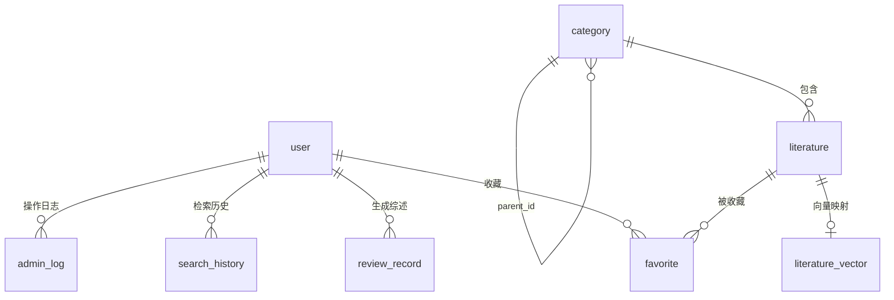

# 数据库设计文档

## 1 数据库概述

本系统采用 **MySQL 8.0** 作为结构化数据存储，主要存储用户信息、文献元数据、两级学科分类、收藏记录、检索历史、综述记录以及 LLM API 配置等数据。

**backend-ai** 模块负责语义检索与向量检索，其 **FAISS 索引文件**不存储在 MySQL 中，而是保存在 `backend-ai/data` 目录下，包括：

- `faiss.index`：向量索引文件
- `id_map.json`：文献 ID 与 FAISS 索引 ID 的映射文件

因此，MySQL 与 FAISS 形成“结构化数据 + 向量索引”的分层存储架构。

---

## 2 数据库设计原则

1. **数据表职责清晰**：每张表只负责一种实体，避免大宽表。
2. **主键统一使用 `id`**：全部表均采用 `BIGINT AUTO_INCREMENT` 作为主键，便于关联与扩展。
3. **文献与分类通过 `category_id` 关联**：`literature.category_id` 外键关联 `category.id`。
4. **分类通过 `parent_id` 支持两级结构**：`parent_id = 0` 表示一级分类，`parent_id != 0` 表示二级分类，文献统一绑定到二级分类。
5. **综述记录与用户关联**：`review_record.user_id` 记录生成者，支持用户查看个人综述历史。
6. **LLM API Key 前端脱敏**：`llm_config.api_key` 明文保存于后端（课程项目演示用途），前端仅展示脱敏值；生产环境应使用 AES 加密或密钥管理服务存储。
7. **删除操作注意数据一致性**：删除文献前需考虑其是否被收藏或引用；删除用户需级联处理收藏与综述记录。

---

## 3 E-R 关系说明

- **user** 1 对多 **favorite**：一个用户可收藏多篇文献。
- **literature** 1 对多 **favorite**：一篇文献可被多个用户收藏。
- **category** 1 对多 **literature**：一个二级分类下有多篇文献。
- **category** 通过 `parent_id` 自关联：形成一级分类和二级分类的两级树形结构。
- **user** 1 对多 **review_record**：一个用户可生成多条综述记录。
- **user** 1 对多 **search_history**：一个用户有多条检索历史。
- **llm_config** 为独立配置表：由管理员维护，同一时间最多只有一条记录的 `active = 1`。
- **admin_log** 记录管理员操作：与用户表独立关联。
- **literature_vector** 记录 FAISS 向量映射：与文献表一对一对应，用于向量检索索引管理。

---

## 4 表结构设计

### 4.1 user 用户表

存储系统注册用户与管理员信息。

| 字段名 | 类型 | 约束 | 说明 |
|--------|------|------|------|
| id | BIGINT | PRIMARY KEY, AUTO_INCREMENT | 用户ID |
| username | VARCHAR(50) | NOT NULL, UNIQUE | 用户名 |
| password_hash | VARCHAR(255) | NOT NULL | 密码哈希（BCrypt加密） |
| real_name | VARCHAR(50) | | 真实姓名 |
| email | VARCHAR(100) | | 邮箱 |
| role | VARCHAR(20) | NOT NULL, DEFAULT 'USER' | 角色：USER（普通用户）、ADMIN（管理员） |
| status | TINYINT | NOT NULL, DEFAULT 1 | 状态：1正常，0禁用 |
| create_time | DATETIME | DEFAULT CURRENT_TIMESTAMP | 创建时间 |
| update_time | DATETIME | DEFAULT CURRENT_TIMESTAMP ON UPDATE CURRENT_TIMESTAMP | 更新时间 |

**说明**：系统初始化时自动创建一个 `role = ADMIN` 的管理员账号，用于后台管理。

---

### 4.2 category 分类表

存储两级学科分类体系。

| 字段名 | 类型 | 约束 | 说明 |
|--------|------|------|------|
| id | BIGINT | PRIMARY KEY, AUTO_INCREMENT | 分类ID |
| name | VARCHAR(100) | NOT NULL | 分类名称 |
| parent_id | BIGINT | DEFAULT 0 | 父分类ID，0表示一级分类 |
| sort_order | INT | DEFAULT 0 | 同级分类排序 |
| create_time | DATETIME | DEFAULT CURRENT_TIMESTAMP | 创建时间 |

**说明**：
- `parent_id = 0` 表示一级分类（如“自然科学”、“工程与技术”）。
- `parent_id != 0` 表示二级分类（如“计算机科学与人工智能”）。
- 文献统一绑定到二级分类，通过 `literature.category_id` 关联。

---

### 4.3 literature 文献表

存储学术文献的核心元数据与正文节选。

| 字段名 | 类型 | 约束 | 说明 |
|--------|------|------|------|
| id | BIGINT | PRIMARY KEY, AUTO_INCREMENT | 文献ID |
| title | VARCHAR(255) | NOT NULL | 文献标题 |
| authors | VARCHAR(255) | | 作者，多个作者用逗号分隔 |
| abstract_text | TEXT | | 摘要 |
| keywords | VARCHAR(255) | | 关键词，多个用逗号分隔 |
| journal | VARCHAR(255) | | 期刊或会议名称 |
| publish_year | INT | | 发表年份 |
| doi | VARCHAR(100) | | DOI号 |
| category_id | BIGINT | | 分类ID，关联 category.id |
| citation_count | INT | DEFAULT 0 | 引用次数 |
| file_url | VARCHAR(500) | | 文献文件地址（可选） |
| source | VARCHAR(255) | | 数据来源 |
| document_type | VARCHAR(50) | | 文献类型：期刊论文、会议论文、学位论文、研究报告 |
| source_url | VARCHAR(255) | | 来源链接 |
| content | TEXT | | 正文节选或文献内容说明 |
| create_time | DATETIME | DEFAULT CURRENT_TIMESTAMP | 创建时间 |
| update_time | DATETIME | DEFAULT CURRENT_TIMESTAMP ON UPDATE CURRENT_TIMESTAMP | 更新时间 |

**说明**：
- `abstract_text` 和 `content` 用于智能检索和综述生成时的文本输入。
- `category_id` 关联 `category.id`，文献绑定到二级分类。

---

### 4.4 favorite 收藏表

记录用户的文献收藏关系。

| 字段名 | 类型 | 约束 | 说明 |
|--------|------|------|------|
| id | BIGINT | PRIMARY KEY, AUTO_INCREMENT | 收藏ID |
| user_id | BIGINT | NOT NULL | 用户ID，关联 user.id |
| literature_id | BIGINT | NOT NULL | 文献ID，关联 literature.id |
| create_time | DATETIME | DEFAULT CURRENT_TIMESTAMP | 收藏时间 |

**说明**：
- 设置 `UNIQUE KEY uk_user_literature (user_id, literature_id)`，避免同一用户重复收藏同一篇文献。

---

### 4.5 search_history 检索历史表

记录用户的检索行为。

| 字段名 | 类型 | 约束 | 说明 |
|--------|------|------|------|
| id | BIGINT | PRIMARY KEY, AUTO_INCREMENT | 历史ID |
| user_id | BIGINT | NOT NULL | 用户ID，关联 user.id |
| keyword | VARCHAR(255) | NOT NULL | 检索关键词 |
| search_type | VARCHAR(30) | DEFAULT 'NORMAL' | 检索类型：NORMAL（普通检索）、SEMANTIC（语义检索） |
| result_count | INT | DEFAULT 0 | 结果数量 |
| create_time | DATETIME | DEFAULT CURRENT_TIMESTAMP | 检索时间 |

**说明**：支持按 `user_id` 和 `create_time` 查询个人检索历史。

---

### 4.6 review_record 综述记录表

存储用户生成的综述结果及其生成方式。

| 字段名 | 类型 | 约束 | 说明 |
|--------|------|------|------|
| id | BIGINT | PRIMARY KEY, AUTO_INCREMENT | 综述记录ID |
| user_id | BIGINT | NOT NULL | 用户ID，关联 user.id |
| topic | VARCHAR(255) | NOT NULL | 综述主题 |
| literature_ids | TEXT | | 使用的文献ID列表，如：1,2,3 |
| content | LONGTEXT | | 生成的综述内容 |
| reference_text | TEXT | | 参考来源说明 |
| generation_mode | VARCHAR(30) | DEFAULT 'rule' | 生成模式 |
| create_time | DATETIME | DEFAULT CURRENT_TIMESTAMP | 生成时间 |
| update_time | DATETIME | DEFAULT CURRENT_TIMESTAMP ON UPDATE CURRENT_TIMESTAMP | 更新时间 |

**说明**：
- `generation_mode` 取值：
  - `rule`：离线规则综述生成
  - `llm`：在线 LLM 综述生成
  - `llm_fallback_rule`：在线 LLM 生成失败或输出不完整，自动降级为离线规则生成
- `reference_text` 以文本形式记录所选文献的标题和ID，便于前端展示参考来源。
- `generation_mode` 字段通过 `update_llm_config.sql` 追加到表中。

---

### 4.7 llm_config LLM API 配置表

由管理员维护，用于配置在线综述生成调用的大模型 API。

| 字段名 | 类型 | 约束 | 说明 |
|--------|------|------|------|
| id | BIGINT | PRIMARY KEY, AUTO_INCREMENT | 配置ID |
| name | VARCHAR(100) | NOT NULL | 配置名称，如 DeepSeek、OpenAI |
| provider | VARCHAR(50) | NOT NULL | 提供商：openai-compatible / openai / deepseek / qwen / custom |
| base_url | VARCHAR(255) | NOT NULL | API Base URL |
| model | VARCHAR(100) | NOT NULL | 模型名称，如 deepseek-chat |
| api_key | TEXT | | API Key |
| enabled | TINYINT | DEFAULT 1 | 是否启用：1启用，0禁用 |
| active | TINYINT | DEFAULT 0 | 是否为当前使用配置：1是，0否 |
| timeout_seconds | INT | DEFAULT 30 | 请求超时时间（秒） |
| remark | VARCHAR(255) | | 备注 |
| create_time | DATETIME | DEFAULT CURRENT_TIMESTAMP | 创建时间 |
| update_time | DATETIME | DEFAULT CURRENT_TIMESTAMP ON UPDATE CURRENT_TIMESTAMP | 更新时间 |

**说明**：
- 同一时间最多只有一条记录的 `active = 1`，表示当前系统使用的 LLM 配置。
- `api_key` 明文保存于后端，仅供课程项目演示；生产环境应使用 AES 加密或环境变量注入。
- 前端通过 `apiKeyMasked` 字段展示脱敏值（如 `sk-ab****cd`），避免泄露完整密钥。

---

### 4.8 admin_log 管理员操作日志表

记录管理员在后台的关键操作，便于审计。

| 字段名 | 类型 | 约束 | 说明 |
|--------|------|------|------|
| id | BIGINT | PRIMARY KEY, AUTO_INCREMENT | 日志ID |
| admin_id | BIGINT | NOT NULL | 管理员用户ID |
| operation | VARCHAR(100) | NOT NULL | 操作类型 |
| target_type | VARCHAR(50) | | 操作对象类型 |
| target_id | BIGINT | | 操作对象ID |
| detail | TEXT | | 操作详情 |
| create_time | DATETIME | DEFAULT CURRENT_TIMESTAMP | 操作时间 |

---

### 4.9 literature_vector 文献向量索引表

记录文献与 FAISS 向量索引的映射关系，用于向量检索索引管理。

| 字段名 | 类型 | 约束 | 说明 |
|--------|------|------|------|
| id | BIGINT | PRIMARY KEY, AUTO_INCREMENT | 向量记录ID |
| literature_id | BIGINT | NOT NULL, UNIQUE | 文献ID，关联 literature.id |
| vector_index_id | BIGINT | | FAISS 中的向量索引ID |
| embedding_model | VARCHAR(100) | | 向量模型名称 |
| update_time | DATETIME | DEFAULT CURRENT_TIMESTAMP ON UPDATE CURRENT_TIMESTAMP | 更新时间 |

**说明**：该表为可选辅助表，主要用于追踪文献向量化状态；实际的语义检索通过调用 backend-ai 服务的 FAISS 索引完成。

---

## 5 索引设计

| 表名 | 索引字段 | 索引类型 | 说明 |
|------|----------|----------|------|
| user | username | 唯一索引 | 用户名唯一 |
| literature | category_id | 普通索引 | 按分类查询文献 |
| literature | publish_year | 普通索引 | 按年份筛选 |
| literature | title | 普通索引 | 标题检索加速 |
| literature | document_type | 普通索引 | 按文献类型筛选 |
| favorite | (user_id, literature_id) | 唯一索引 | 防止重复收藏 |
| review_record | user_id | 普通索引 | 查询个人综述历史 |
| search_history | (user_id, create_time) | 普通索引 | 查询个人检索历史 |
| llm_config | active | 普通索引 | 快速获取当前使用配置 |

**补充说明**：`literature` 表的 `abstract_text` 和 `content` 字段长度较大，不适合建立 B-Tree 索引；若需要全文检索能力，可考虑使用 MySQL 全文索引（FULLTEXT），但本系统目前的语义检索主要通过 backend-ai 的 FAISS 向量索引实现，MySQL 仅作为结构化数据查询支撑。

---

## 6 数据初始化说明

`database/` 目录下包含以下 SQL 脚本，用于数据库初始化和数据导入：

| 脚本文件 | 说明 |
|----------|------|
| `init.sql` | 创建全部基础表结构，初始化管理员账号和示例分类数据 |
| `update_categories.sql` | 补充或更新两级学科分类数据 |
| `literature_seed_100.sql` | 导入 100 条模拟文献数据 |
| `literature_seed_500_high_quality.sql` | 导入 500 条高质量模拟文献数据，覆盖多个学科领域 |
| `update_llm_config.sql` | 新增 `llm_config` 表，并为 `review_record` 表追加 `generation_mode` 字段 |

**注意事项**：
- 执行数据导入脚本后，需要管理员在后台点击 **“重建智能检索索引”**，backend-ai 才会将新导入的文献数据构建为 FAISS 向量索引。
- `init.sql` 中初始管理员密码为明文占位值，首次登录后建议通过后端加密逻辑更新为 BCrypt 哈希值。

---

## 7 与智能检索的关系

1. **MySQL 存储文献结构化数据**：标题、作者、摘要、关键词、年份、分类等元数据保存在 `literature` 表中。
2. **backend-ai 负责向量化**：根据文献标题、分类、文献类型、关键词、摘要和正文节选生成语义向量。
3. **FAISS 索引独立存储**：向量索引文件（`faiss.index`、`id_map.json`）保存在 `backend-ai/data` 目录，不存入 MySQL。
4. **索引重建流程**：Spring Boot 从 MySQL 查询文献列表 → 调用 backend-ai 重建接口 → backend-ai 重新生成 FAISS 索引。
5. **检索回查**：语义检索返回 `literatureId` 后，Spring Boot 回查 MySQL 补全文献的完整信息（标题、作者、摘要等）。

---

## 8 与综述生成的关系

1. **数据来源**：综述生成使用 `literature` 表中的 `title`、`authors`、`publish_year`、`journal`、`keywords`、`abstract_text`、`content` 等字段构造 prompt。
2. **结果存储**：生成的综述内容保存到 `review_record.content`，同时记录 `generation_mode` 以标识生成方式。
3. **在线 LLM 配置**：在线综述生成使用 `llm_config` 表中 `active = 1` 的配置调用外部大模型 API。
4. **降级机制**：当在线 LLM 生成超时、输出截断或不可用时，系统自动降级为离线规则生成，结果仍正常保存，但 `generation_mode` 记录为 `llm_fallback_rule`。
5. **参考文献来源**：`review_record.reference_text` 以文本形式记录所选文献，便于前端展示综述的参考来源。

---

## 9 数据安全与维护

1. **用户密码加密存储**：后端使用 BCrypt 对密码进行哈希处理，数据库中仅保存 `password_hash`。
2. **API Key 前端脱敏**：`llm_config.api_key` 前端仅展示脱敏值，完整密钥仅在后端使用。
3. **生产环境建议**：`api_key` 应使用 AES 加密存储，密钥通过环境变量注入，避免明文泄露。
4. **删除文献前检查**：删除 `literature` 记录前，应检查是否存在关联的 `favorite` 收藏记录，避免数据不一致。
5. **索引重建**：新增或批量修改大量文献后，需触发 backend-ai 重建 FAISS 索引，否则语义检索结果可能不完整。

---

## 10 小结

本数据库设计以 MySQL 为核心，支撑了校园学术文献智能检索与综述生成系统的以下功能：

- **用户与权限管理**：`user` 表区分普通用户与管理员角色。
- **文献与分类管理**：`literature` 与 `category` 表形成两级学科分类体系。
- **用户交互**：`favorite` 和 `search_history` 记录用户收藏与检索行为。
- **综述生成**：`review_record` 保存综述结果，通过 `generation_mode` 区分离线生成、在线 LLM 生成及降级生成。
- **LLM API 管理**：`llm_config` 表由管理员维护，支持多配置切换。
- **智能检索分层存储**：MySQL 负责结构化数据，backend-ai 的 FAISS 索引负责语义向量检索，两者协同完成智能检索功能。
