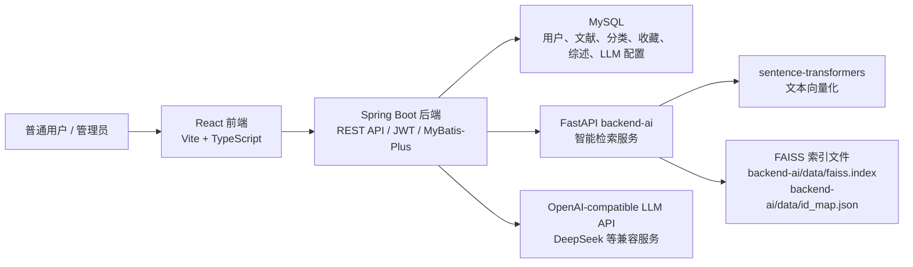
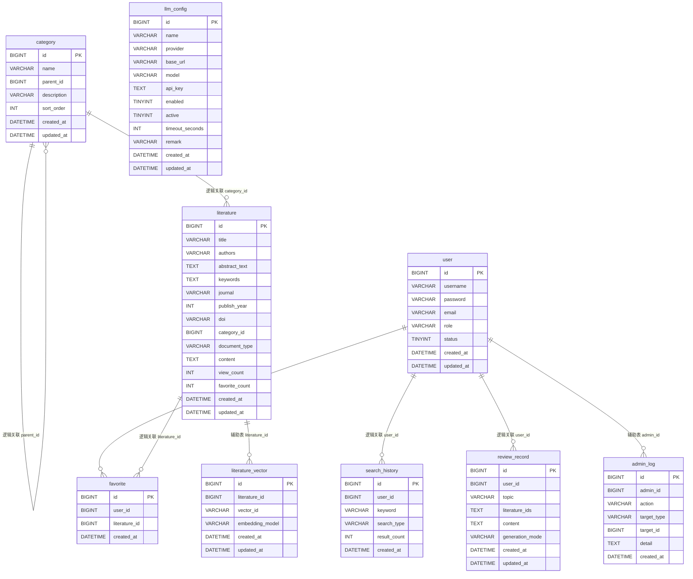
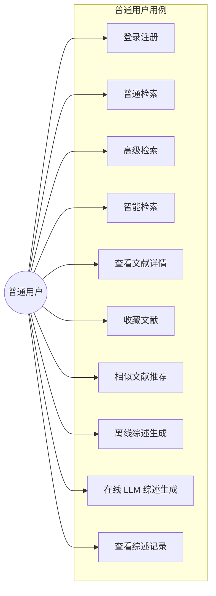
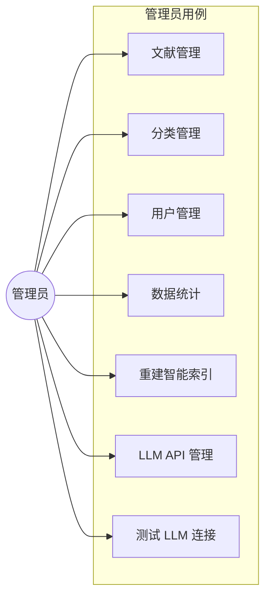
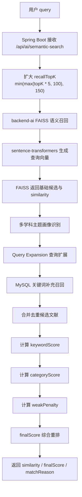
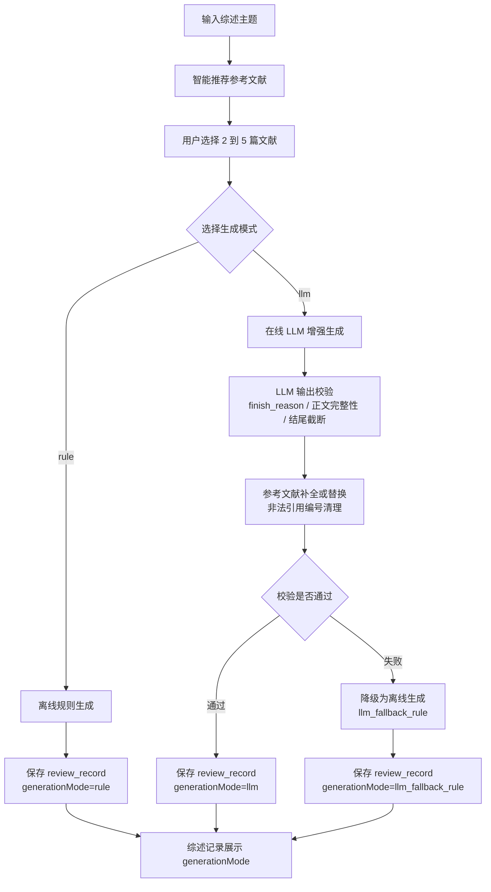
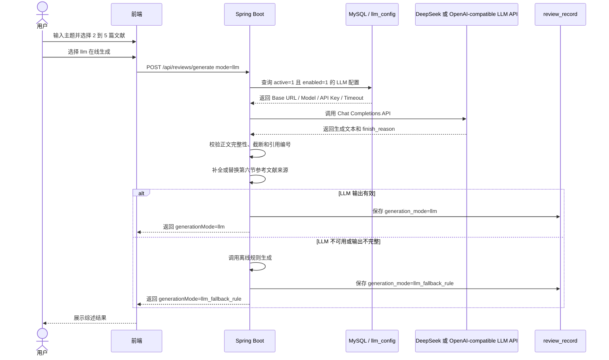
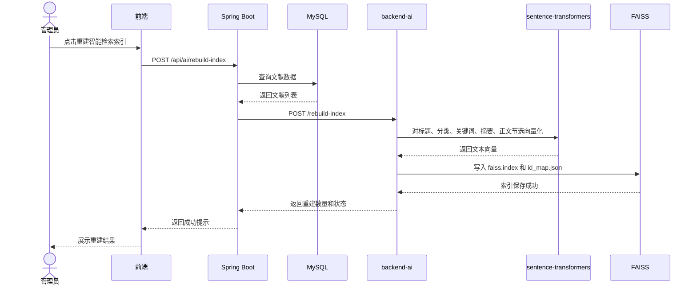
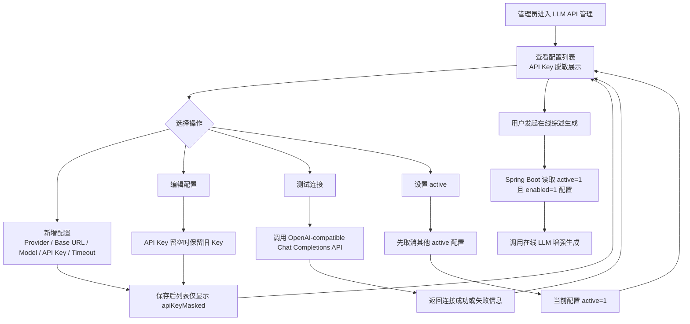

# 系统图表汇总

本文档集中保存正式报告可引用的 Mermaid 图表。报告正文建议只插入图号、图名和简要说明，完整 Mermaid 源码以本文档为准。

## 图 4-1 系统总体架构图

说明：Spring Boot 是主业务后端，负责权限、数据库访问、智能检索重排和综述生成分流。backend-ai 负责向量化、FAISS 召回和相似推荐。在线 LLM 是增强能力，离线综述生成仍是默认稳定模式。

## 图 4-2 功能结构图

```mermaid
flowchart TB
    SYS["校园学术文献智能检索与综述生成系统"]

    SYS --> USER["普通用户端"]
    USER --> U1["注册与登录"]
    USER --> U2["普通检索 / 高级检索"]
    USER --> U3["多学科智能语义检索"]
    USER --> U4["文献详情 / 收藏 / 我的收藏"]
    USER --> U5["相似文献推荐"]
    USER --> U6["智能推荐参考文献"]
    USER --> U7["离线综述生成"]
    USER --> U8["在线 LLM 增强综述生成"]
    USER --> U9["综述记录查看与 generationMode 筛选"]

    SYS --> ADMIN["管理员端"]
    ADMIN --> A1["管理员登录"]
    ADMIN --> A2["文献管理"]
    ADMIN --> A3["分类管理"]
    ADMIN --> A4["用户管理"]
    ADMIN --> A5["数据统计"]
    ADMIN --> A6["重建智能检索索引"]
    ADMIN --> A7["LLM API 管理"]
    ADMIN --> A8["测试 LLM API 连接"]

    SYS --> AI["backend-ai 智能检索服务"]
    AI --> I1["健康检查"]
    AI --> I2["重建 FAISS 索引"]
    AI --> I3["语义召回"]
    AI --> I4["相似推荐"]

    SYS --> LLM["在线 LLM 增强服务"]
    LLM --> L1["读取 active LLM 配置"]
    LLM --> L2["调用 OpenAI-compatible API"]
    LLM --> L3["输出完整性校验"]
    LLM --> L4["参考文献补全与引用清理"]
    LLM --> L5["失败时降级为 llm_fallback_rule"]
```

## 图 4-3 数据库 E-R 图

说明：当前 SQL 主要通过字段建立逻辑关联，并未为所有关系显式声明外键。`admin_log` 和 `literature_vector` 是辅助表；实际 FAISS 向量索引文件保存在 `backend-ai/data`，不存入 MySQL。

## 图 5-1 普通用户用例图

## 图 5-2 管理员用例图

## 图 6-1 智能检索流程图

## 图 6-2 综述生成流程图

## 图 6-3 在线 LLM 综述生成时序图

## 图 6-4 管理员重建智能索引时序图

## 图 6-5 LLM API 管理流程图

