# 系统图表汇总

本文档集中保存正式报告可引用的 Mermaid 图表。报告正文建议只插入图号、图名和简要说明，完整 Mermaid 源码以本文档为准。

## 图 3-1 顶层数据流图

导出图片：docs/diagrams/figure-3-1-dfd-context.png

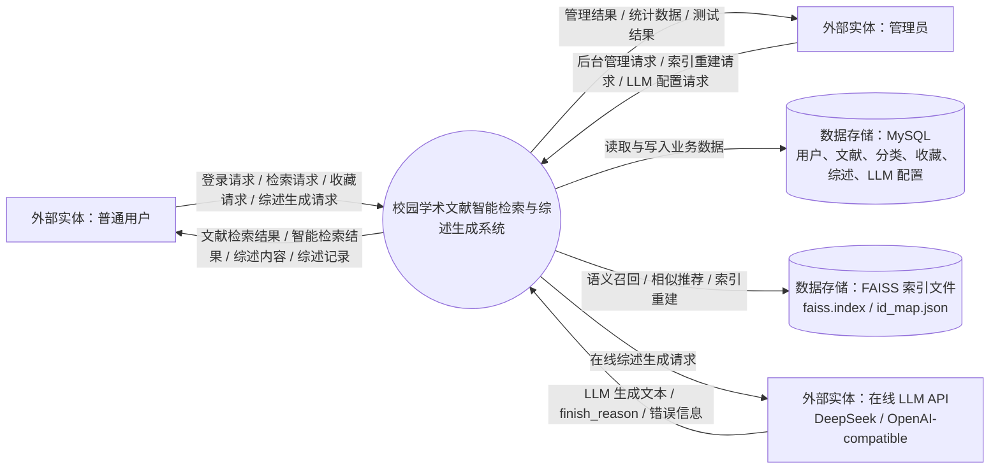

说明：顶层 DFD 表达系统与外部实体、MySQL 数据库、FAISS 索引文件和在线 LLM API 之间的数据交换。在线 LLM 只用于增强综述生成，不是系统唯一生成方式。

## 图 3-2 0 层数据流图

导出图片：docs/diagrams/figure-3-2-dfd-level0.png

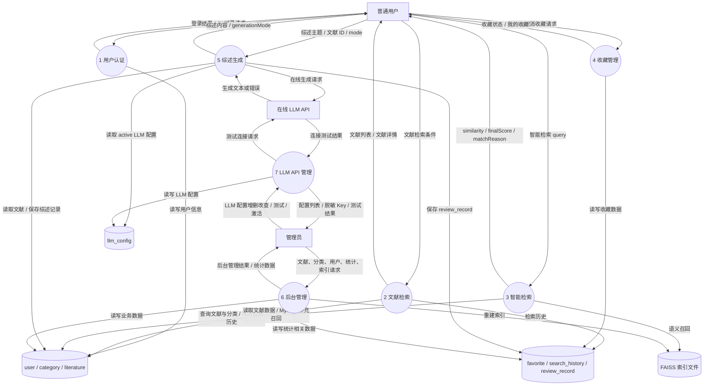

## 图 3-3 智能检索 1 层数据流图

导出图片：docs/diagrams/figure-3-3-dfd-ai-search.png

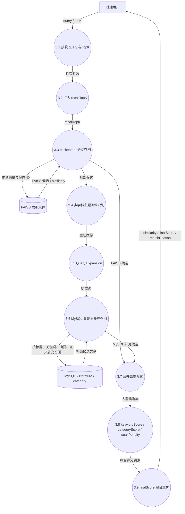

## 图 3-4 综述生成 1 层数据流图

导出图片：docs/diagrams/figure-3-4-dfd-review-generation.png

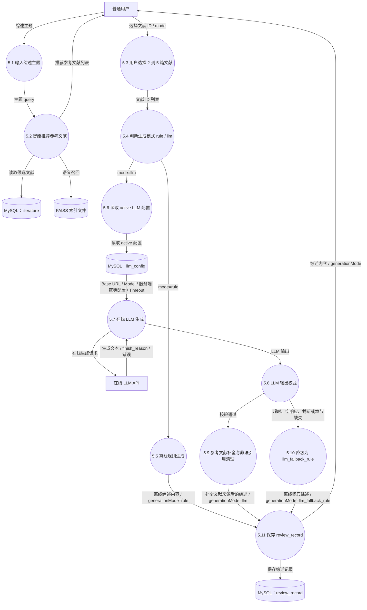

## 图 4-1 系统总体架构图

导出图片：docs/diagrams/figure-4-1-system-architecture.png

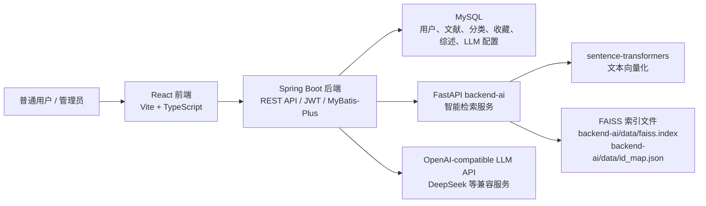

说明：Spring Boot 是主业务后端，负责权限、数据库访问、智能检索重排和综述生成分流。backend-ai 负责向量化、FAISS 召回和相似推荐。在线 LLM 是增强能力，离线综述生成仍是默认稳定模式。

## 图 4-2 功能结构图

导出图片：docs/diagrams/figure-4-2-function-structure.png

```mermaid
flowchart TB
    SYS["校园学术文献智能检索与综述生成系统"]

    SYS --> USER["普通用户端"]
    USER --> U1["注册与登录"]
    USER --> U2["普通检索 / 高级检索"]
    USER --> U3["多学科智能语义检索"]
    USER --> U4["文献详情 / 收藏 / 我的收藏"]
    USER --> U5["相似文献推荐"]
    USER --> U6["智能推荐参考文献"]
    USER --> U7["离线综述生成"]
    USER --> U8["在线 LLM 增强综述生成"]
    USER --> U9["综述记录查看与 generationMode 筛选"]

    SYS --> ADMIN["管理员端"]
    ADMIN --> A1["管理员登录"]
    ADMIN --> A2["文献管理"]
    ADMIN --> A3["分类管理"]
    ADMIN --> A4["用户管理"]
    ADMIN --> A5["数据统计"]
    ADMIN --> A6["重建智能检索索引"]
    ADMIN --> A7["LLM API 管理"]
    ADMIN --> A8["测试 LLM API 连接"]

    SYS --> AI["backend-ai 智能检索服务"]
    AI --> I1["健康检查"]
    AI --> I2["重建 FAISS 索引"]
    AI --> I3["语义召回"]
    AI --> I4["相似推荐"]

    SYS --> LLM["在线 LLM 增强服务"]
    LLM --> L1["读取 active LLM 配置"]
    LLM --> L2["调用 OpenAI-compatible API"]
    LLM --> L3["输出完整性校验"]
    LLM --> L4["参考文献补全与引用清理"]
    LLM --> L5["失败时降级为 llm_fallback_rule"]
```

## 图 4-3 数据库 E-R 图

导出图片：docs/diagrams/figure-4-3-er-diagram.png

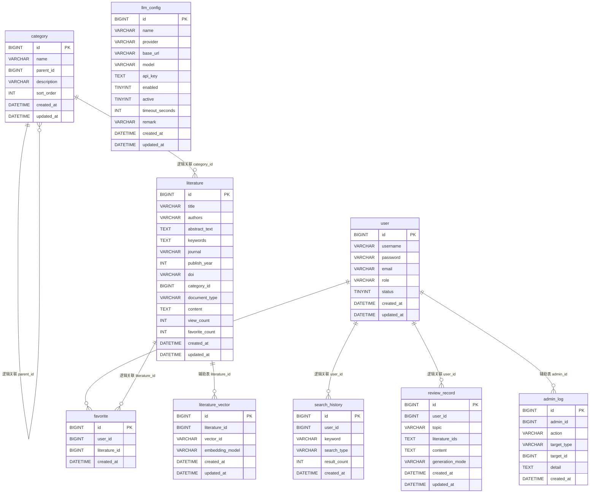

说明：当前 SQL 主要通过字段建立逻辑关联，并未为所有关系显式声明外键。`admin_log` 和 `literature_vector` 是辅助表；实际 FAISS 向量索引文件保存在 `backend-ai/data`，不存入 MySQL。

## 图 5-1 普通用户用例图

导出图片：docs/diagrams/figure-5-1-user-usecase.png

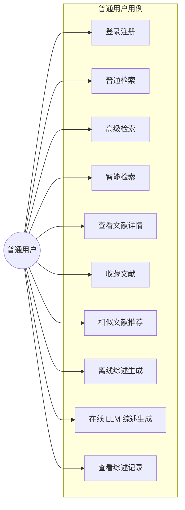

## 图 5-2 管理员用例图

导出图片：docs/diagrams/figure-5-2-admin-usecase.png

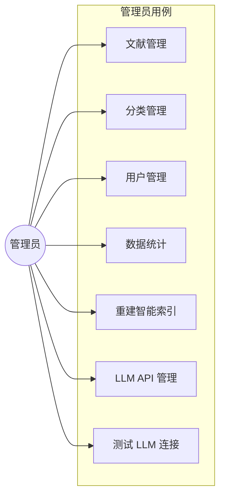

## 图 6-1 智能检索流程图

导出图片：docs/diagrams/figure-6-1-semantic-search-flow.png

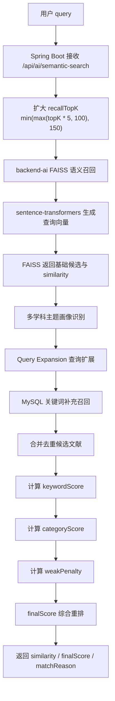

## 图 6-2 综述生成流程图

导出图片：docs/diagrams/figure-6-2-review-generation-flow.png

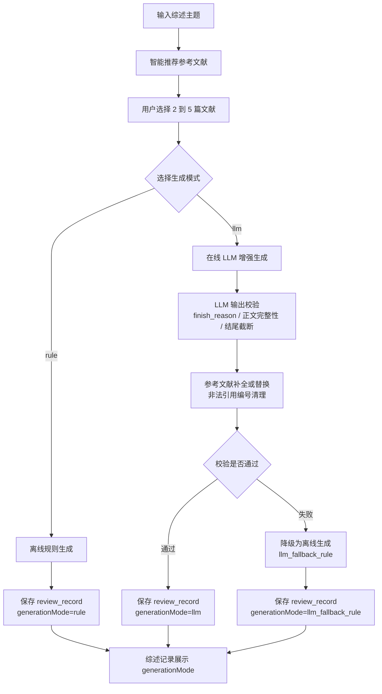

## 图 6-3 在线 LLM 综述生成时序图

导出图片：docs/diagrams/figure-6-3-llm-review-sequence.png

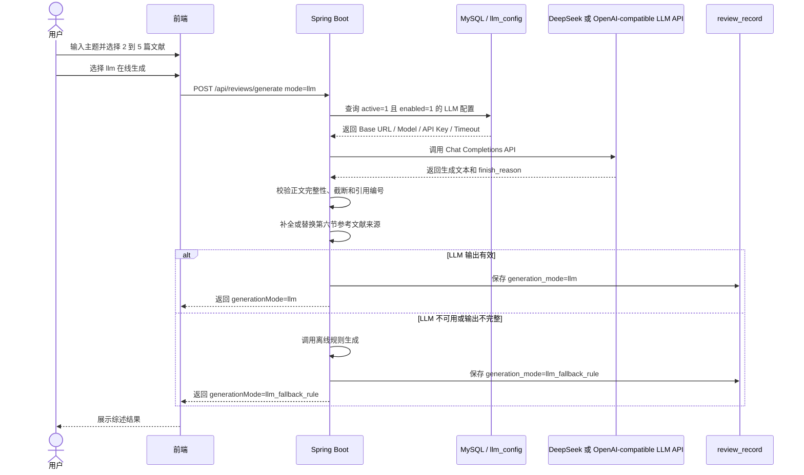

## 图 6-4 管理员重建智能索引时序图

导出图片：docs/diagrams/figure-6-4-rebuild-index-sequence.png

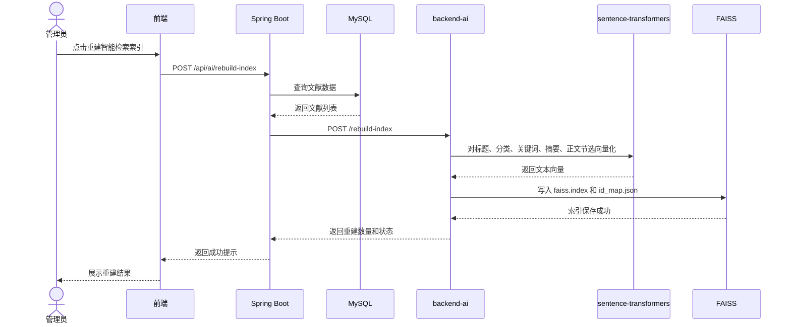

## 图 6-5 LLM API 管理流程图

导出图片：docs/diagrams/figure-6-5-llm-api-management-flow.png

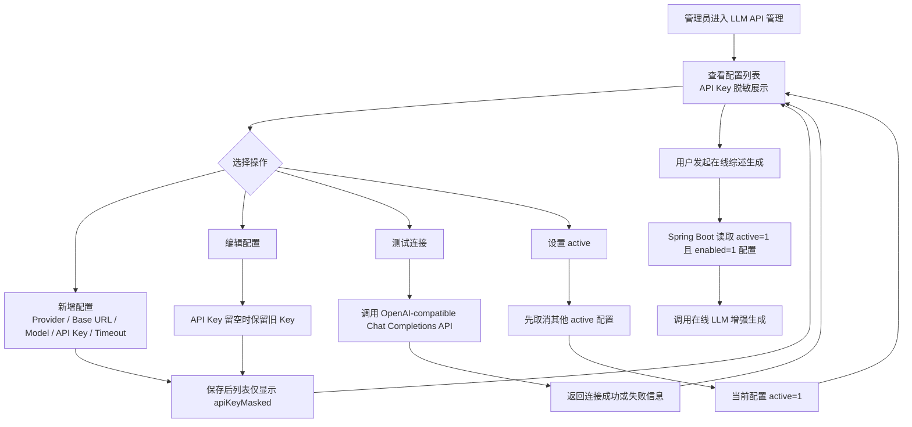

## 图 6-6 RAG 风格综述生成流程图

导出图片：docs/diagrams/figure-6-6-rag-review-flow.png

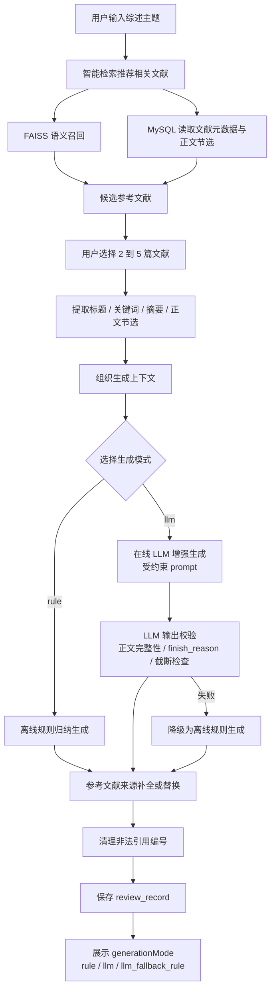

说明：本图表达的是本项目采用的 RAG 思想和检索增强式综述生成流程，不表示完整工业级 RAG 平台。系统没有实现复杂 chunk 管理、专门向量数据库服务、多轮 RAG Agent 或流式 RAG。

## 图 4-4 模块结构图（SC 图）

导出图片：docs/diagrams/figure-4-4-module-structure-sc.png

```mermaid
flowchart TD
    SYS["校园学术文献智能检索与综述生成系统"]

    SYS --> USER["普通用户端"]
    USER --> U1["注册登录"]
    USER --> U2["普通检索 / 高级检索"]
    USER --> U3["智能检索"]
    USER --> U4["文献详情 / 收藏 / 相似推荐"]
    USER --> U5["综述生成"]
    USER --> U6["综述记录与 generationMode 筛选"]

    SYS --> ADMIN["管理员端"]
    ADMIN --> A1["文献管理"]
    ADMIN --> A2["分类管理"]
    ADMIN --> A3["用户管理"]
    ADMIN --> A4["真实数据统计"]
    ADMIN --> A5["智能索引重建"]
    ADMIN --> A6["LLM API 管理"]

    SYS --> SPRING["Spring Boot 主业务模块"]
    SPRING --> C1["Controller 接口层"]
    SPRING --> C2["Service 业务层"]
    SPRING --> C3["Mapper 数据访问层"]
    SPRING --> C4["Security 权限控制"]

    SYS --> AI["backend-ai 智能检索模块"]
    AI --> B1["健康检查"]
    AI --> B2["索引重建"]
    AI --> B3["语义检索"]
    AI --> B4["相似推荐"]

    SYS --> DATA["数据存储模块"]
    DATA --> D1["MySQL 业务数据"]
    DATA --> D2["FAISS 索引文件"]
    DATA --> D3["id_map.json 映射文件"]

    SYS --> LLM["在线 LLM 增强模块"]
    LLM --> L1["读取 active LLM 配置"]
    LLM --> L2["调用 OpenAI-compatible API"]
    LLM --> L3["输出完整性校验"]
    LLM --> L4["参考文献补全与降级"]
```

说明：SC 图强调系统模块层次和调用职责。普通用户端和管理员端通过 Spring Boot 访问业务能力；backend-ai 只负责语义向量检索和索引文件；在线 LLM 是可选增强模块，不是系统唯一生成方式。

## 图 5-3 面向对象类图

导出图片：docs/diagrams/figure-5-3-class-diagram.png

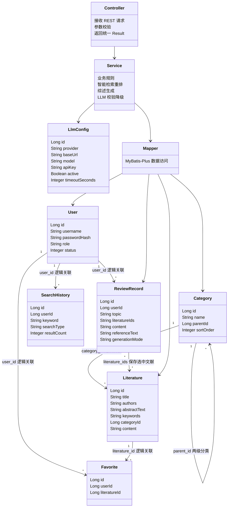

说明：本图体现面向对象设计中的实体类、业务层和数据访问层。SQL 中多数关系以逻辑关联实现，报告中不应写成数据库强制外键。

## 图 5-4 智能检索重排算法图

导出图片：docs/diagrams/figure-5-4-semantic-rerank-algorithm.png

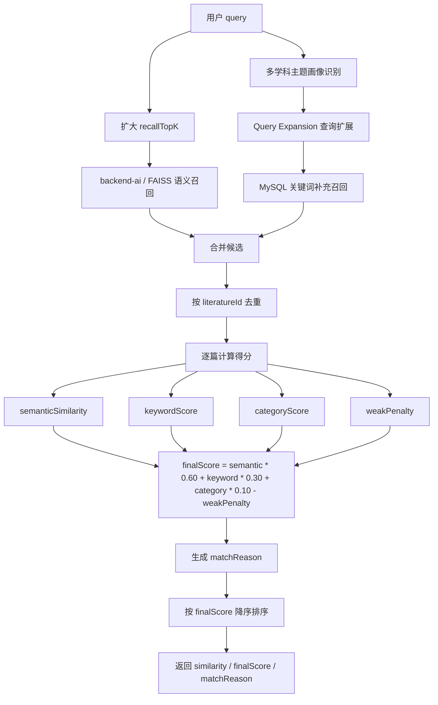

说明：本图来自 `AiServiceImpl.java` 中的智能检索实现。它体现本项目不是直接返回 FAISS TopK，而是将语义召回、关键词补充召回、分类得分和弱相关降权合并为最终排序。

## 图 5-5 LLM 输出校验与降级流程图

导出图片：docs/diagrams/figure-5-5-llm-validation-fallback.png

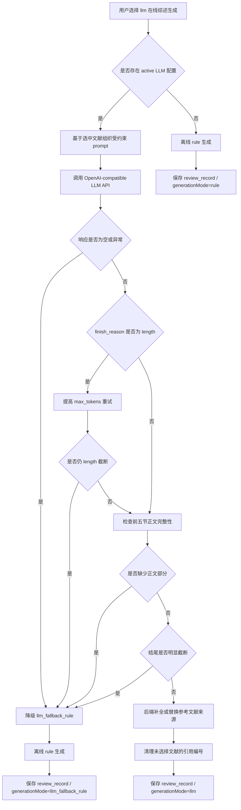

说明：本图来自 `ReviewRecordServiceImpl.java` 和 `LlmReviewServiceImpl.java` 的实际逻辑。第六节参考文献来源由后端补全或替换，避免 LLM 编造不存在的参考文献。

## 图 6-20 项目代码结构图

导出图片：docs/diagrams/figure-6-20-code-structure.png

```mermaid
flowchart TD
    ROOT["campus-literature-system"]

    ROOT --> FE["frontend"]
    FE --> FE_API["src/api<br/>请求封装"]
    FE --> FE_ROUTES["src/routes<br/>页面路由"]
    FE --> FE_COMP["src/components<br/>通用组件"]

    ROOT --> BJ["backend-java"]
    BJ --> BJ_CTRL["controller<br/>REST 接口"]
    BJ --> BJ_SERVICE["service/impl<br/>业务实现"]
    BJ --> BJ_MAPPER["mapper<br/>数据库访问"]
    BJ --> BJ_ENTITY["entity / dto / vo<br/>数据对象"]
    BJ --> BJ_SECURITY["security<br/>JWT 与权限拦截"]

    ROOT --> BA["backend-ai"]
    BA --> BA_MAIN["main.py<br/>FastAPI 服务"]
    BA --> BA_DATA["data/faiss.index<br/>data/id_map.json"]
    BA --> BA_REQ["requirements.txt"]

    ROOT --> DB["database"]
    DB --> DB_INIT["init.sql"]
    DB --> DB_CAT["update_categories.sql"]
    DB --> DB_SEED["literature_seed_500_high_quality.sql"]
    DB --> DB_LLM["update_llm_config.sql"]

    ROOT --> DOCS["docs"]
    DOCS --> REPORT["final-report-draft.md / final-report.docx"]
    DOCS --> DIAG["diagrams.md / diagrams 图片"]
    DOCS --> SHOT["screenshots 运行截图"]
```

说明：本图用于编码实现章节，说明项目目录和核心代码位置。它不表示新增代码结构，只是对现有仓库组织进行可视化整理。

## 图 7-1 测试与缺陷闭环图

导出图片：docs/diagrams/figure-7-1-test-defect-loop.png

```mermaid
flowchart LR
    PLAN["制定测试计划"] --> CASE["设计测试用例"]
    CASE --> EXEC["执行构建 / 接口 / 页面 / 边界测试"]
    EXEC --> RECORD{"是否发现问题"}
    RECORD -->|否| PASS["记录通过结果"]
    RECORD -->|是| BUG["记录缺陷现象"]
    BUG --> ANALYZE["分析原因"]
    ANALYZE --> FIX["修复实现或配置"]
    FIX --> REG["回归验证"]
    REG --> RESULT{"是否修复"}
    RESULT -->|否| ANALYZE
    RESULT -->|是| PASS
    PASS --> REPORT["整理测试报告和缺陷分析"]

    EXEC --> BUILD["编译构建测试"]
    EXEC --> API["接口测试"]
    EXEC --> UI["页面操作测试"]
    EXEC --> SEC["权限与异常测试"]
    EXEC --> LLM["LLM 降级与脱敏测试"]
```

说明：本图对应系统测试章节，用于展示从测试计划、用例执行、缺陷记录、修复到回归验证的闭环过程。
