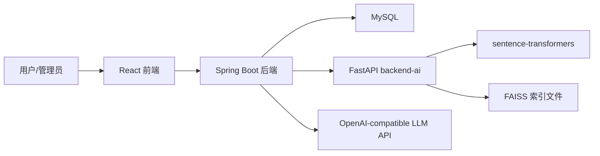

# 正文写作细纲

本文档用于撰写课程正式报告正文。最终目录以 `docs/report-outline-final.md` 为准，本细纲负责说明每一章应写什么、应避免什么，并同步当前代码和 SQL 的实际实现。

## 摘要

写作重点：

- 说明系统面向校园课程项目场景，解决文献检索、相似文献发现和综述整理效率问题。
- 技术路线写为 React + Vite + TypeScript、Spring Boot、MySQL、FastAPI、sentence-transformers、FAISS。
- 明确文献数据是课程项目模拟数据，不是真实论文库。
- 突出多学科智能语义检索不是单纯 FAISS 检索，而是结合主题画像、Query Expansion、MySQL 补充召回和综合重排。
- 突出综述生成支持 `rule` 离线稳定模式和 `llm` 在线增强模式，在线不可用时记录 `llm_fallback_rule`。
- 说明管理员可维护文献、分类、用户、统计、智能索引和 LLM API 配置。

关键词建议：学术文献检索、多学科语义检索、综述生成、FAISS、LLM API、Spring Boot、RAG。

Keywords 写作提示：英文关键词可对应写为 literature retrieval、multidisciplinary semantic search、review generation、FAISS、LLM API、Spring Boot。数量保持 5 到 7 个，避免加入未实现功能。

图表插入建议：正文图表优先引用 `docs/diagrams.md` 中的 Mermaid 图，报告正文只保留图号、图名和必要说明，避免把大段 Mermaid 源码直接堆入正文。

运行截图插入建议：运行截图建议统一放入 `docs/screenshots/`，截图清单参考 `docs/screenshots-guide.md`，在正文实现章节少量引用关键截图，完整截图放入附录 D。

## 1 引言

### 1.1 项目背景

写作要点：

- 高校学习和科研训练需要查阅大量文献。
- 传统关键词检索对自然语言主题理解不足。
- 纯向量语义检索对“人工智能”等宽泛词可能过度泛化，跨学科查询容易跑偏。
- 综述写作需要筛选多篇文献并综合归纳，人工整理成本高。
- 大模型可提升语言表达，但存在 API 不稳定、超时、输出截断和成本问题，因此系统保留离线稳定生成方案。

### 1.2 项目目标

写作要点：

- 完成校园学术文献查询、管理、收藏和综述生成系统。
- 支持普通检索、高级检索、多学科智能语义检索、相似文献推荐。
- 支持智能推荐参考文献，再由用户选择 2 到 5 篇文献生成综述。
- 支持离线综述生成和在线 LLM 增强综述生成。
- 支持管理员维护文献、分类、用户、统计、智能索引和 LLM API 配置。

### 1.3 项目意义

从普通用户、管理员、课程实践、技术实践四个角度写：

- 普通用户提高检索、收藏、推荐和综述整理效率。
- 管理员可维护模拟文献库和系统配置。
- 课程实践覆盖需求分析、设计、编码、测试、文档整理全过程。
- 技术实践体现前后端分离、向量检索、主题重排、LLM 工程化接入与降级。

### 1.4 项目特色

必须写清楚：

- 6 个一级分类、37 个二级分类，文献绑定二级分类。
- `literature_seed_500_high_quality.sql` 提供 500 条课程项目模拟文献。
- backend-ai 使用 sentence-transformers + FAISS。
- Spring Boot 负责多学科主题画像、Query Expansion、MySQL 关键词补充召回、`finalScore` 重排和 `matchReason` 原因解释。
- 离线综述生成是默认稳定方案。
- 在线 LLM 是增强方案，不是唯一方案。
- 管理员维护 LLM API，前端只显示脱敏 Key。
- LLM 参考文献由后端校验、补全或替换，不允许模型自由编造。

## 2 可行性分析

### 2.1 技术可行性

说明：

- 前端 React + Vite + TypeScript 适合实现检索、详情、收藏、综述和管理后台页面。
- Spring Boot + MyBatis-Plus 适合实现 REST API、权限控制和 MySQL 访问。
- MySQL 可支撑用户、文献、分类、收藏、搜索历史、综述记录和 LLM 配置。
- FastAPI 可独立封装 Python 语义检索服务。
- sentence-transformers 可生成中文语义向量。
- FAISS 可保存和检索向量索引。
- OpenAI-compatible API 调用方式能兼容 DeepSeek 等服务。

### 2.2 经济可行性

写开源框架、本地部署、模拟数据。在线 LLM 是可选增强，没有 API Key 时系统仍可使用离线生成。

### 2.3 操作可行性

普通用户流程：检索文献 → 查看详情 → 收藏或查看相似推荐 → 输入主题 → 智能推荐参考文献 → 选择生成方式 → 查看综述记录。

管理员流程：登录后台 → 维护文献和分类 → 重建智能索引 → 配置 LLM API → 管理用户和查看统计。

### 2.4 安全与规范可行性

必须说明：

- 用户密码使用 BCrypt 哈希。
- JWT 控制登录态和管理员权限。
- API Key 前端脱敏展示。
- 课程演示可保存 LLM 配置，生产环境应加密存储、密钥轮换、访问审计。
- 模拟文献不能写成真实论文库。
- AI 辅助开发和文档整理应说明人工最终整合、测试和验收。

## 3 需求分析

### 3.1 角色分析

普通用户：

- 注册、登录
- 普通检索、高级检索、智能检索
- 文献详情、收藏、我的收藏
- 相似文献推荐
- 智能推荐参考文献
- 离线/在线综述生成
- 综述记录查看、删除、按 generationMode 筛选

管理员：

- 登录后台
- 文献管理、分类管理、用户管理、数据统计
- 重建智能检索索引
- LLM API 配置增删改查
- 设置 active 配置
- 测试连接和长文本综述测试
- 查看 API Key 脱敏值

### 3.2 文献检索需求

普通检索：

- 查询字段：标题、摘要、关键词、正文节选。
- 支持作者、分类、年份、文献类型、排序、分页。
- 登录用户普通检索会写入 `search_history`，当前语义检索接口未写入该表。

高级检索：

- 支持标题、关键词、作者、期刊、DOI、分类、文献类型、起止年份、排序。
- 后端实际排序支持 `year_desc`、`year_asc`、`citation_desc`、`citation_asc`、默认按 id 倒序。

### 3.3 智能检索需求

输入：自然语言 query、`topK`。

输出：文献列表、`similarity`、`finalScore`、`matchReason`。

流程必须按真实代码写：

1. Spring Boot 接收 `/api/ai/semantic-search` 请求。
2. 将 `topK` 扩大为 `recallTopK = min(max(topK * 5, 100), 150)`。
3. 调用 backend-ai `/semantic-search` 获取 FAISS 候选。
4. 识别主题画像。
5. 根据主题取扩展词。
6. 对具体主题执行 MySQL 补充召回，匹配 `title`、`keywords`、`abstract_text`、`content`。
7. 合并 FAISS 候选和 MySQL 补充候选并去重。
8. 计算 `keywordScore`、`categoryScore`、`weakPenalty`。
9. 按 `finalScore` 降序返回。

主题画像必须覆盖：

- 教育主题
- 医学健康主题
- 心理健康主题
- 文献检索主题
- 农业生态主题
- 法学治理主题
- 经济管理主题
- 人文艺术主题
- 工程技术主题
- 自然科学主题
- 人工智能通用主题

`finalScore` 写法：

```text
finalScore = semanticSimilarity * 0.60
           + keywordScore * 0.30
           + categoryScore * 0.10
           - weakPenalty
```

`keywordScore` 字段权重：

- 标题命中加 0.35
- 关键词命中加 0.30
- 摘要命中加 0.20
- 正文命中加 0.10
- 分类命中加 0.05
- 最高不超过 1.0

`matchReason` 可包含：

- 语义相似度或关键词补充召回
- 命中主题
- 字段命中原因
- 命中扩展词
- 分类相关
- 是否弱相关降权

注意：后端返回 `matchReason`，当前前端检索页主要展示 `similarity`，推荐原因展示可作为后续界面优化点。

### 3.4 相似文献推荐需求

路径：

- Spring Boot：`GET /api/ai/recommend/{literatureId}`
- backend-ai：`POST /recommend`

逻辑：

- 使用目标文献在 FAISS 中的向量检索 `topK + 1`。
- 排除当前文献自身。
- 返回相似文献和相似度。

### 3.5 综述生成需求

输入：

- `topic`：综述主题
- `literatureIds`：2 到 5 篇文献 ID
- `mode`：`rule` 或 `llm`

输出：

- `content`
- `references`
- `generationMode`
- `createTime`

离线模式 `rule`：

- 默认模式。
- 不依赖外部 API。
- 基于本地规则生成。
- 支持主题识别、关键词提取、研究方向归纳、问题与趋势生成。
- 作为稳定兜底方案。

在线模式 `llm`：

- 调用管理员配置的 active LLM API。
- 支持 DeepSeek / OpenAI-compatible API。
- 用户端可选择在线生成。
- 管理员端配置 Base URL、Model、API Key、Timeout。
- API Key 前端脱敏显示。

降级模式 `llm_fallback_rule`：

- 用户请求 `mode=llm`。
- 如果无 active 配置、API Key 为空、超时、HTTP 错误、JSON 解析失败、空响应、输出截断、正文部分缺失等，后端自动调用离线生成。
- 记录 `generationMode=llm_fallback_rule`。

### 3.6 LLM 输出控制需求

必须写：

- 检查 `finish_reason`。
- 如果 `finish_reason=length`，系统会用更高 `max_tokens` 重试一次。
- 检查前五个正文部分是否完整。
- 检查结尾是否明显截断。
- 第六节“参考文献来源”由后端强制补全或替换。
- 清理不存在的引用编号。
- 不允许 LLM 编造参考文献。
- `generationMode` 记录最终生成方式。

注意写法：

- 正文前五节不完整时会降级。
- 缺少第六节本身不等于失败，只要正文完整，后端可以补全第六节。
- 参考文献列表必须来自用户选择的文献。

## 4 系统总体设计

### 4.1 架构设计

推荐图示：



文字说明：

- React 前端负责页面交互。
- Spring Boot 负责认证、权限、业务编排、数据库访问、智能检索重排、综述生成。
- MySQL 存储结构化数据。
- backend-ai 存储 FAISS 文件并提供语义召回。
- LLM API 仅在在线增强综述模式调用。

### 4.2 功能模块

普通用户模块：

- 首页
- 搜索页
- 高级检索页
- 文献详情页
- 收藏页
- 检索历史页
- 综述生成页
- 综述记录页

管理员模块：

- 后台首页
- 文献管理
- 分类管理
- 用户管理
- 数据统计
- 重建智能索引
- LLM API 管理

### 4.3 数据库设计

表必须按真实 SQL 写：

- `user`
- `category`
- `literature`
- `favorite`
- `search_history`
- `review_record`
- `admin_log`
- `literature_vector`
- `llm_config`

说明：

- SQL 中主要通过字段进行逻辑关联，未显式声明外键约束。
- `review_record.generation_mode` 由 `update_llm_config.sql` 追加。
- `llm_config.api_key` 课程演示中存储于数据库，前端仅返回 `apiKeyMasked`；生产环境应加密。
- FAISS 索引不是 MySQL 表，文件位于 `backend-ai/data/`。

## 5 详细设计与实现

### 5.1 前端实现

重点写：

- `frontend/src/api/request.ts` 统一配置 `http://localhost:8080/api`。
- `auth.ts` 封装注册登录和 localStorage 会话。
- `literature.ts` 封装普通检索、高级检索、详情和管理员文献 CRUD。
- `ai.ts` 封装智能检索、相似推荐和索引重建。
- `review.ts` 封装综述生成、历史、详情、删除，生成请求包含 `mode`。
- `llm-config.ts` 封装管理员 LLM 配置接口。
- `review-generate.tsx` 支持离线/在线生成方式切换。
- `review-history.tsx` 支持 generationMode 标签和筛选。
- `admin.index.tsx` 提供重建智能索引入口。
- `admin.llm-configs.tsx` 提供 LLM 配置增删改查、active、测试连接、长文本测试。

### 5.2 Spring Boot 后端实现

按层说明：

- Controller：`AuthController`、`LiteratureController`、`FavoriteController`、`CategoryController`、`AiController`、`ReviewRecordController`、`AdminController`、`LlmConfigController`、`SearchHistoryController`。
- DTO：登录注册、检索、智能检索、综述生成、LLM 配置、文献和分类请求。
- Entity：对应数据库表。
- Service：业务逻辑、检索重排、综述生成、LLM 调用、权限校验。
- Mapper：MyBatis-Plus 和少量自定义 SQL。
- Security：JWT 拦截器、用户上下文。

### 5.3 backend-ai 实现

写：

- 模型：`sentence-transformers/paraphrase-multilingual-MiniLM-L12-v2`。
- 向量化字段：标题重复、分类、文献类型、关键词重复、摘要、正文节选。
- L2 归一化后用 FAISS `IndexFlatIP`，内积等价于余弦相似度。
- `faiss.index` 和 `id_map.json` 持久化在 `backend-ai/data`。
- 启动时尝试加载模型和已有索引。

### 5.4 离线综述生成实现

写：

- `ReviewRecordServiceImpl.generate()` 根据 `mode` 分流。
- `mode` 非 `llm` 时进入本地规则生成。
- 主题枚举包括教育、医学、心理、文献检索、农业、法学、经济、人文、工程和通用主题。
- 从所选文献关键词中提取高频词。
- 将文献分配到研究方向。
- 构造六部分内容：研究背景、研究现状、主要研究方向、存在问题、发展趋势、参考文献来源。
- 保存 `review_record`，记录 `generation_mode=rule`。

### 5.5 在线 LLM 增强实现

写：

- `ReviewRecordServiceImpl` 读取 `llm_config` 中 `active=1 and enabled=1` 的配置。
- `LlmReviewServiceImpl` 兼容 OpenAI-compatible Chat Completions。
- 生成 prompt 时限制摘要和正文节选长度，减少超时和截断。
- 请求体包含 `model`、`temperature=0.3`、`max_tokens`、`messages`。
- 第一次请求 `max_tokens=2500`，如果 `finish_reason=length`，第二次用 `max_tokens=3000` 重试。
- 调用异常或输出校验失败时降级。

### 5.6 LLM API 管理实现

写：

- 后端路径 `/api/admin/llm-configs`。
- 仅管理员可访问。
- 字段：`name`、`provider`、`baseUrl`、`model`、`apiKey`、`enabled`、`active`、`timeoutSeconds`、`remark`。
- `active` 设置会先 `deactivateAll()`。
- 编辑时 `apiKey` 为空表示不修改旧 Key。
- 返回 VO 使用 `apiKeyMasked`。
- `test` 调用真实 Chat Completions API 验证连接。
- `test-review` 是实际已实现的长文本综述测试接口，可在文档中作为补充接口说明。

## 6 测试写作

测试范围：

- 编译构建测试
- 用户认证测试
- 文献检索测试
- 收藏测试
- 智能检索测试
- 相似推荐测试
- 离线综述生成测试
- 在线 LLM 综述生成测试
- LLM 降级测试
- 综述记录 generationMode 测试
- 管理员功能测试
- LLM API 管理测试
- 权限与异常处理测试

测试命令建议：

```powershell
cd backend-ai
python -m py_compile main.py
```

```powershell
cd backend-java
mvn clean package -DskipTests
```

```powershell
cd frontend
npm run build
```

## 7 部署写作

启动顺序：

1. MySQL
2. 执行 SQL
3. backend-ai
4. backend-java
5. frontend
6. 管理员重建智能检索索引
7. 管理员配置 LLM API

注意：

- 文献更新后要重建索引。
- LLM API Key 不写入文档和 Git。
- 数据库密码按本机环境配置，不在报告中给真实值。
- backend-ai 首次加载模型可能较慢。

## 8 项目不足与后续展望

只能作为展望，不能写成已实现：

- 接入真实论文数据库。
- PDF 上传与全文解析。
- BM25 + 向量混合检索。
- Cross-Encoder Rerank。
- LLM 流式输出。
- Docker 部署。
- API Key 加密存储与密钥轮换。
- 更完善的引用校验与学术格式化。

## 9 项目总结与小组分工写作

项目总结部分需要写明系统完成情况、项目不足和小组成员分工。小组分工建议放在 `10.3 小组分工与收获`，内容包括：

- 学校、专业班级、组别、项目名称和小组人数。
- 每位成员的姓名、学号、角色。
- 每位成员的主要分工。
- 自评工作比例。
- 周思源作为组长在项目总体规划、需求分析、系统架构设计、主体开发、核心功能实现、联调、文档主体撰写和最终汇报准备中承担主要工作。

成员信息和分工表可参考 `docs/team-info.md`，正式报告中可按需保留表格或改写为段落。

## 10 避免写错

- 不要说 500 条文献是真实论文。
- 不要说系统完全依赖 LLM。
- 不要说 LLM 可以自由生成参考文献。
- 不要把 API Key 明文存储写成安全方案。
- 不要写真实 API Key、数据库密码、Token。
- 不要把 PDF 上传、真实论文库、Docker、流式输出、Cross-Encoder Rerank 写成已实现功能。

附录 F 写作提示：项目开发日志应引用 `docs/dev-log.md`，按阶段说明从 MVP、智能检索、综述生成、LLM 接入到文档整理的过程，并记录已修复问题，不需要粘贴完整聊天记录或代码 diff。
